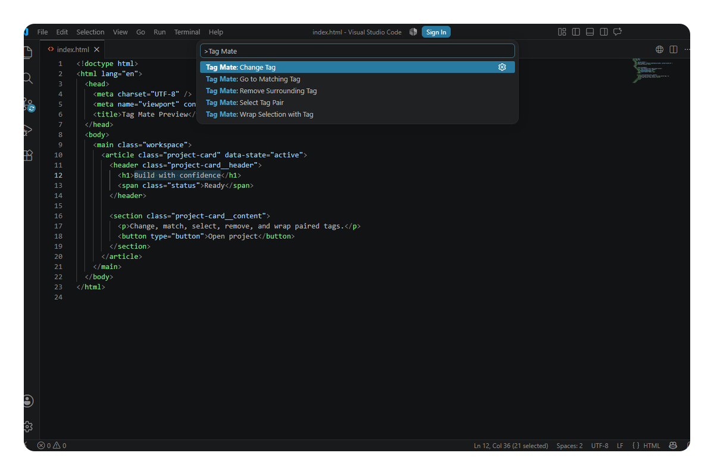

  

# Tag Mate

**Change, match, wrap, and remove paired markup tags**

  
  
  

---

### Use

Open an HTML file. Run a Tag Mate command from the Command Palette. **Change Tag** is also available from the editor context menu.

- **Change Tag** updates opening and closing names together.
- **Go to Matching Tag** jumps between concrete opening and closing tags.
- **Select Tag Pair** selects the complete element or one void/self-closing tag.
- **Remove Surrounding Tag** removes only a concrete wrapper pair.
- **Wrap Selection with Tag** wraps one or more non-overlapping selections.

Tag Mate 0.1 supports HTML. It understands nested same-name elements, quoted angle brackets, comments, raw script/style text, multiline tags, custom elements, void elements, mixed case, and optional end tags. Unsafe, malformed, overlapping, or larger-than-2-MiB operations stop without editing. It adds no webview, telemetry, workspace scan, default keybinding, or automatic rename/close behavior.

### Development

Requires pnpm 12. `pnpm install`, then `pnpm run quality`. Press F5 to run the extension. See [development notes](docs/development.md).

---

  
  <a href="https://github.com/gvastethecreator"><picture><source media="(prefers-color-scheme: dark)" srcset="https://shieldcn.dev/badge/follow%20me-/gvastethecreator.png?size=xs&amp;logo=github&amp;brand=github&amp;mode=dark"></picture></a>
  <a href="https://github.com/sponsors/gvastethecreator"><picture><source media="(prefers-color-scheme: dark)" srcset="https://shieldcn.dev/badge/support%20this-project.png?size=xs&amp;logo=ri%3APiHeartFill&amp;logoColor=b85a90&amp;brand=github&amp;mode=dark"></picture></a>

